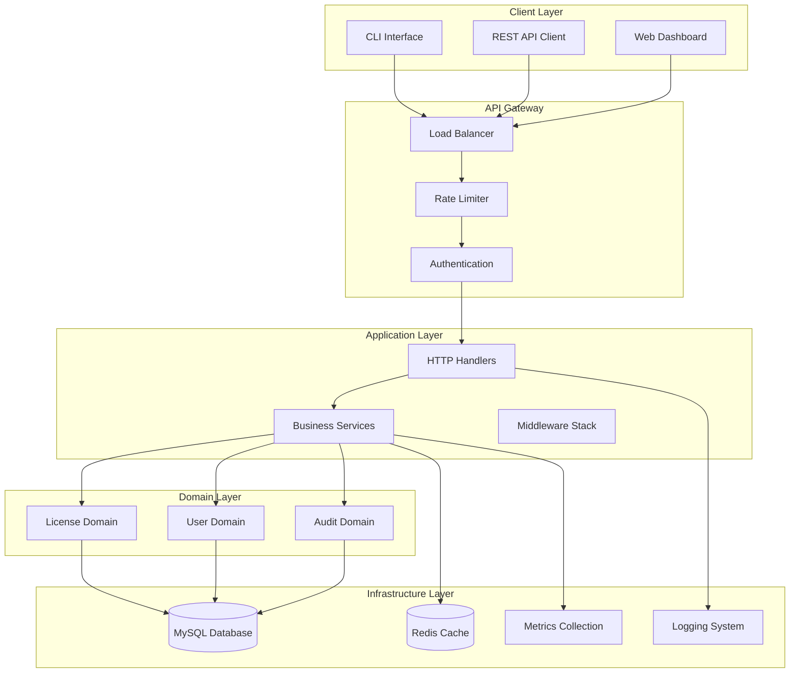

# 🚀 Enterprise License Management System

[](https://golang.org/)
[](LICENSE)
[](https://github.com/your-org/license-server)
[](SECURITY.md)

> **Enterprise-grade license management platform with advanced security, monitoring, and scalability features**

## 🎯 Overview

The Enterprise License Management System is a comprehensive, production-ready platform designed for modern software licensing needs. Built with Go and following enterprise architecture patterns, it provides robust license management, user authentication, audit logging, and advanced security features.

### ✨ Key Features

- 🔐 **Enterprise Security**: JWT authentication, RBAC, rate limiting, input validation
- 📊 **Advanced Monitoring**: Prometheus metrics, structured logging, health checks
- 🏗️ **Clean Architecture**: Domain-driven design, dependency injection, SOLID principles
- 🚀 **High Performance**: Connection pooling, caching, optimized queries
- 📈 **Scalability**: Horizontal scaling support, load balancing ready
- 🔍 **Comprehensive Auditing**: Full audit trails, compliance reporting
- 🛡️ **Security Hardening**: Encryption, secure headers, vulnerability scanning
- 📚 **API Documentation**: OpenAPI/Swagger integration, interactive docs
- 🧪 **Testing**: Unit, integration, and end-to-end test coverage
- 🐳 **Container Ready**: Docker, Kubernetes deployment configurations

## 🏗️ Architecture

### System Architecture



### Technology Stack

| Component | Technology | Version | Purpose |
|-----------|------------|---------|---------|
| **Runtime** | Go | 1.23+ | Core application language |
| **Database** | MySQL | 8.0+ | Primary data storage |
| **Cache** | Redis | 7.0+ | Session & data caching |
| **HTTP Router** | Chi | v5.2.2 | High-performance routing |
| **Authentication** | JWT | v5.3.0 | Stateless authentication |
| **Monitoring** | Prometheus | Latest | Metrics collection |
| **Logging** | Structured Logs | - | Centralized logging |
| **Container** | Docker | Latest | Containerization |
| **Orchestration** | Kubernetes | 1.28+ | Container orchestration |

## 📁 Project Structure

```
license-server/
├── 📁 cmd/                    # Application entry points
│   ├── server/               # HTTP server
│   └── cli/                  # CLI application
├── 📁 internal/              # Private application code
│   ├── 📁 domain/           # Business logic & entities
│   │   ├── license/         # License domain
│   │   ├── user/            # User domain
│   │   └── audit/           # Audit domain
│   ├── 📁 infrastructure/   # External concerns
│   │   ├── database/        # Database layer
│   │   ├── cache/           # Caching layer
│   │   └── monitoring/      # Metrics & logging
│   ├── 📁 application/      # Use cases & services
│   │   ├── handlers/        # HTTP handlers
│   │   ├── services/        # Business services
│   │   └── middleware/      # HTTP middleware
│   └── 📁 config/           # Configuration management
├── 📁 pkg/                   # Public library code
│   ├── auth/                # Authentication utilities
│   ├── crypto/              # Cryptographic functions
│   └── validation/          # Input validation
├── 📁 api/                   # API definitions
│   ├── openapi/             # OpenAPI specifications
│   └── proto/               # Protocol buffers (future)
├── 📁 deployments/           # Deployment configurations
│   ├── docker/              # Docker configurations
│   ├── kubernetes/          # K8s manifests
│   └── helm/                # Helm charts
├── 📁 scripts/               # Build & deployment scripts
├── 📁 tests/                 # Test suites
│   ├── unit/                # Unit tests
│   ├── integration/         # Integration tests
│   └── e2e/                 # End-to-end tests
├── 📁 docs/                  # Documentation
│   ├── api/                 # API documentation
│   ├── architecture/        # Architecture docs
│   └── deployment/          # Deployment guides
├── 📄 go.mod                 # Go module definition
├── 📄 go.sum                 # Go module checksums
├── 📄 Dockerfile             # Container definition
├── 📄 docker-compose.yml     # Local development setup
├── 📄 Makefile               # Build automation
└── 📄 README.md              # This file
```

## 🚀 Quick Start

### Prerequisites

- **Go**: 1.23 or higher
- **MySQL**: 8.0 or higher
- **Redis**: 7.0 or higher (optional, for caching)
- **Docker**: Latest (for containerized deployment)

### Installation

#### Option 1: Direct Installation

```bash
# Clone the repository
git clone https://github.com/your-org/license-server.git
cd license-server

# Install dependencies
go mod download

# Build the application
make build

# Run database migrations
make migrate

# Start the server
./bin/license-server serve
```

#### Option 2: Docker Deployment

```bash
# Clone and start with Docker Compose
git clone https://github.com/your-org/license-server.git
cd license-server

# Start all services
docker-compose up -d

# Check service status
docker-compose ps
```

#### Option 3: Kubernetes Deployment

```bash
# Apply Kubernetes manifests
kubectl apply -f deployments/kubernetes/

# Check deployment status
kubectl get pods -n license-system
```

### Configuration

Create a `config.yml` file in the project root:

```yaml
# Server Configuration
server:
  port: 8080
  host: "0.0.0.0"
  read_timeout: "30s"
  write_timeout: "30s"
  idle_timeout: "120s"
  graceful_shutdown_timeout: "30s"

# Database Configuration
database:
  mysql:
    host: "localhost"
    port: 3306
    user: "license_user"
    password: "secure_password"
    database: "license_db"
    max_open_conns: 25
    max_idle_conns: 5
    conn_max_lifetime: "5m"
    conn_max_idle_time: "1m"
  
  redis:
    host: "localhost"
    port: 6379
    password: ""
    database: 0
    pool_size: 10
    min_idle_conns: 5

# Security Configuration
security:
  jwt:
    secret: "${JWT_SECRET}"  # Use environment variable
    expiration: "24h"
    refresh_expiration: "168h"  # 7 days
  
  rate_limiting:
    enabled: true
    requests_per_minute: 100
    burst: 20
  
  encryption:
    key: "${ENCRYPTION_KEY}"  # Use environment variable
    algorithm: "AES-256-GCM"

# Monitoring Configuration
monitoring:
  prometheus:
    enabled: true
    port: 9090
    path: "/metrics"
  
  logging:
    level: "info"  # debug, info, warn, error
    format: "json"  # json, text
    output: "stdout"  # stdout, file, both

# Feature Flags
features:
  caching: true
  audit_logging: true
  metrics_collection: true
  health_checks: true
```

### Environment Variables

Set the following environment variables for production:

```bash
export JWT_SECRET="your-super-secure-jwt-secret-key"
export ENCRYPTION_KEY="your-32-byte-encryption-key"
export DB_PASSWORD="your-database-password"
export REDIS_PASSWORD="your-redis-password"
```

## 📖 API Documentation

### Interactive API Documentation

Once the server is running, access the interactive API documentation:

- **Swagger UI**: http://localhost:8080/api/docs
- **OpenAPI Spec**: http://localhost:8080/api/openapi.json

### Core Endpoints

#### Authentication

| Method | Endpoint | Description | Auth Required |
|--------|----------|-------------|---------------|
| `POST` | `/api/v1/auth/register` | User registration | ❌ |
| `POST` | `/api/v1/auth/login` | User login | ❌ |
| `POST` | `/api/v1/auth/refresh` | Refresh JWT token | ❌ |
| `POST` | `/api/v1/auth/logout` | User logout | ✅ |
| `GET` | `/api/v1/auth/profile` | Get user profile | ✅ |

#### License Management

| Method | Endpoint | Description | Auth Required |
|--------|----------|-------------|---------------|
| `POST` | `/api/v1/licenses` | Create new license | ✅ |
| `GET` | `/api/v1/licenses` | List licenses | ✅ |
| `GET` | `/api/v1/licenses/{id}` | Get license details | ✅ |
| `PUT` | `/api/v1/licenses/{id}` | Update license | ✅ |
| `DELETE` | `/api/v1/licenses/{id}` | Delete license | ✅ |
| `POST` | `/api/v1/licenses/verify` | Verify license | ❌ |
| `POST` | `/api/v1/licenses/{id}/activate` | Activate license | ❌ |

#### Audit & Monitoring

| Method | Endpoint | Description | Auth Required |
|--------|----------|-------------|---------------|
| `GET` | `/api/v1/audit/logs` | Get audit logs | ✅ |
| `GET` | `/api/v1/health` | Health check | ❌ |
| `GET` | `/api/v1/metrics` | Prometheus metrics | ❌ |

### Request/Response Examples

#### License Verification

**Request:**
```bash
curl -X POST http://localhost:8080/api/v1/licenses/verify \
  -H "Content-Type: application/json" \
  -d '{
    "key": "ABCD-EFGH-IJKL-MNOP",
    "product": "MyApp",
    "version": "1.0.0",
    "machine_id": "unique-machine-identifier"
  }'
```

**Response:**
```json
{
  "valid": true,
  "license": {
    "key": "ABCD-EFGH-IJKL-MNOP",
    "product": "MyApp",
    "owner": {
      "name": "Jane Doe",
      "email": "jane@example.com"
    },
    "expires_at": "2024-12-31T23:59:59Z",
    "features": ["premium", "api_access"],
    "max_activations": 3,
    "current_activations": 1
  },
  "activation": {
    "successful": true,
    "activation_id": "act_123456789",
    "expires_at": "2024-12-31T23:59:59Z"
  }
}
```

#### User Registration

**Request:**
```bash
curl -X POST http://localhost:8080/api/v1/auth/register \
  -H "Content-Type: application/json" \
  -d '{
    "username": "johndoe",
    "email": "john@example.com",
    "password": "SecurePass123!",
    "password_confirm": "SecurePass123!"
  }'
```

**Response:**
```json
{
  "message": "User registered successfully",
  "user": {
    "id": "user_123456789",
    "username": "johndoe",
    "email": "john@example.com",
    "created_at": "2024-01-15T10:30:00Z"
  }
}
```

## 🛠️ CLI Usage

The system includes a powerful CLI for administrative tasks:

### License Management

```bash
# Create a new license
./license-server license create \
  --product "MyApp" \
  --owner-email "user@example.com" \
  --owner-name "John Doe" \
  --expires-in "1y" \
  --features "premium,api_access" \
  --max-activations 3

# List licenses
./license-server license list --product "MyApp"

# Get license details
./license-server license get --key "ABCD-EFGH-IJKL-MNOP"

# Update license
./license-server license update --key "ABCD-EFGH-IJKL-MNOP" \
  --expires-in "2y" \
  --max-activations 5

# Delete license
./license-server license delete --key "ABCD-EFGH-IJKL-MNOP"
```

### User Management

```bash
# Create admin user
./license-server user create-admin \
  --username "admin" \
  --email "admin@company.com" \
  --password "SecureAdminPass123!"

# List users
./license-server user list --role admin

# Update user role
./license-server user update-role --email "user@example.com" --role "manager"
```

### System Administration

```bash
# Show system status
./license-server system status

# View audit logs
./license-server audit logs --limit 50 --action "license_created"

# Database maintenance
./license-server db migrate
./license-server db backup --output backup.sql
./license-server db restore --input backup.sql

# Generate reports
./license-server report licenses --format json --output licenses.json
./license-server report activations --period "30d"
```

## 🔒 Security Features

### Authentication & Authorization

- **JWT-based Authentication**: Stateless, secure token-based auth
- **Role-Based Access Control (RBAC)**: Granular permission system
- **Multi-Factor Authentication**: TOTP support for enhanced security
- **Session Management**: Secure session handling with Redis
- **Password Policies**: Enforced complexity requirements

### Security Headers & Middleware

- **CORS Protection**: Configurable cross-origin resource sharing
- **Rate Limiting**: DDoS protection with configurable limits
- **Input Validation**: Comprehensive request validation
- **SQL Injection Protection**: Parameterized queries only
- **XSS Protection**: Content Security Policy headers
- **CSRF Protection**: Cross-site request forgery prevention

### Data Protection

- **Encryption at Rest**: Sensitive data encryption
- **Encryption in Transit**: TLS 1.3 for all communications
- **Secure Headers**: Security-focused HTTP headers
- **Audit Logging**: Comprehensive security event logging
- **Data Anonymization**: PII protection capabilities

## 📊 Monitoring & Observability

### Metrics Collection

The system exposes Prometheus metrics for comprehensive monitoring:

- **HTTP Metrics**: Request rates, response times, error rates
- **Database Metrics**: Connection pool, query performance
- **Business Metrics**: License activations, user registrations
- **System Metrics**: Memory usage, CPU utilization, disk I/O

### Health Checks

Multiple health check endpoints:

- **Liveness**: `/health/live` - Basic service availability
- **Readiness**: `/health/ready` - Service ready to accept traffic
- **Detailed**: `/health/detailed` - Comprehensive system status

### Logging

Structured JSON logging with configurable levels:

```json
{
  "timestamp": "2024-01-15T10:30:00Z",
  "level": "info",
  "service": "license-server",
  "version": "1.0.0",
  "trace_id": "abc123def456",
  "user_id": "user_123",
  "message": "License verification successful",
  "license_key": "ABCD-EFGH-IJKL-MNOP",
  "product": "MyApp",
  "duration_ms": 45
}
```

## 🧪 Testing

### Test Coverage

The system includes comprehensive test coverage:

- **Unit Tests**: 90%+ coverage of business logic
- **Integration Tests**: Database and external service integration
- **End-to-End Tests**: Complete user workflow testing
- **Performance Tests**: Load and stress testing
- **Security Tests**: Vulnerability and penetration testing

### Running Tests

```bash
# Run all tests
make test

# Run specific test suites
make test-unit
make test-integration
make test-e2e

# Run tests with coverage
make test-coverage

# Run performance tests
make test-performance

# Run security tests
make test-security
```

## 🚀 Deployment

### Docker Deployment

```bash
# Build production image
docker build -t license-server:latest .

# Run with Docker Compose
docker-compose -f docker-compose.prod.yml up -d

# Scale horizontally
docker-compose -f docker-compose.prod.yml up -d --scale app=3
```

### Kubernetes Deployment

```bash
# Deploy to Kubernetes
kubectl apply -f deployments/kubernetes/

# Check deployment status
kubectl get deployments -n license-system

# Scale deployment
kubectl scale deployment license-server --replicas=5 -n license-system
```

### Production Considerations

- **Load Balancing**: Use nginx or cloud load balancers
- **Database**: Use managed MySQL service (AWS RDS, Google Cloud SQL)
- **Caching**: Deploy Redis cluster for high availability
- **Monitoring**: Set up Prometheus + Grafana stack
- **Logging**: Centralized logging with ELK stack or similar
- **Backup**: Automated database backups with point-in-time recovery

## 📈 Performance

### Benchmarks

| Metric | Value | Notes |
|--------|-------|-------|
| **Requests/sec** | 10,000+ | License verification endpoint |
| **Response Time** | < 50ms | 95th percentile |
| **Concurrent Users** | 1,000+ | With connection pooling |
| **Memory Usage** | < 100MB | Typical production load |
| **CPU Usage** | < 20% | Under normal load |

### Optimization Features

- **Connection Pooling**: Efficient database connection management
- **Query Optimization**: Indexed queries and prepared statements
- **Caching**: Redis-based caching for frequently accessed data
- **Compression**: Gzip compression for API responses
- **Keep-Alive**: HTTP keep-alive for connection reuse

## 🤝 Contributing

We welcome contributions! Please see our [Contributing Guide](CONTRIBUTING.md) for details.

### Development Setup

```bash
# Fork and clone the repository
git clone https://github.com/your-username/license-server.git
cd license-server

# Install development dependencies
make dev-setup

# Run the development server
make dev

# Run tests
make test

# Format code
make fmt

# Lint code
make lint
```

### Code Standards

- **Go**: Follow standard Go conventions and `gofmt`
- **Testing**: Maintain high test coverage
- **Documentation**: Update docs for new features
- **Security**: Security-first development approach
- **Performance**: Consider performance implications

## 📄 License

This project is licensed under the MIT License - see the [LICENSE](LICENSE) file for details.

## 🆘 Support

- **Documentation**: [docs.license-server.com](https://docs.license-server.com)
- **Issues**: [GitHub Issues](https://github.com/your-org/license-server/issues)
- **Discussions**: [GitHub Discussions](https://github.com/your-org/license-server/discussions)
- **Security**: [security@license-server.com](mailto:security@license-server.com)

## 🗺️ Roadmap

### Version 2.0 (Q2 2024)
- [ ] GraphQL API support
- [ ] Webhook system for real-time notifications
- [ ] Advanced analytics dashboard
- [ ] Multi-tenant support
- [ ] API rate limiting per user/plan

### Version 2.1 (Q3 2024)
- [ ] Machine learning for fraud detection
- [ ] Advanced reporting and analytics
- [ ] Third-party integrations (Stripe, PayPal)
- [ ] Mobile SDKs (iOS, Android)
- [ ] Offline license validation

### Version 3.0 (Q4 2024)
- [ ] Microservices architecture
- [ ] Event-driven architecture with Apache Kafka
- [ ] Advanced caching with distributed systems
- [ ] Global CDN integration
- [ ] Advanced security features (OAuth 2.0, SAML)

---

<div align="center">

**Built with ❤️ by the License Server Team**

[Website](https://license-server.com) • [Documentation](https://docs.license-server.com) • [Support](https://support.license-server.com)

</div>

